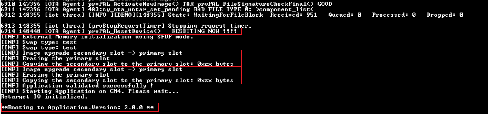

# AWS IoT and FreeRTOS for PSoC 6 MCU: Storing Wi-Fi Firmware Into External Flash and Upgrading it Over-The-Air (OTA)

Wi-Fi firmware consumes about 400 KB of flash. When the Wi-Fi firmware is stored in the internal flash along with the application, available flash size for the main application is reduced. Since [MCUboot](https://github.com/mcu-tools/mcuboot/releases/tag/v1.6.1-cypress) supports storing the primary image only in the internal flash, Wi-Fi firmware is separated out from the main application and stored in external flash to reduce the size of main application. 

This code example demonstrates detaching the Wi-Fi firmware from the application and performing either a solitary upgrade of the application firmware or upgrading the application and Wi-Fi firmware together.

Both application firmware and Wi-Fi firmware are built as [MCUboot](https://juullabs-oss.github.io/mcuboot/)-compatible applications.

This code example includes the following applications:

**bootloader_cm0p:** The bootloader is a tiny app based on [MCUboot](https://juullabs-oss.github.io/mcuboot/). This is the first application to start on every reset, and runs entirely on the CM0+ CPU. It is responsible for validating the firmware images in the primary and secondary slots (for all compatible image instances), performing necessary upgrades, and booting the CM4 CPU. See the [MCUboot-based Basic Bootloader](https://github.com/cypresssemiconductorco/mtb-example-psoc6-mcuboot-basic) example to understand the basics.

**app_cm4:** This application is designed to run on the CM4 CPU of PSoC® 6 MCU. This is a tiny FreeRTOS application that blinks the LED at different rates based on build-time configurations and built-in capabilities of the OTA upgrade. Generally, the Wi-Fi application contains the Wi-Fi firmware that needs to be loaded into the Wi-Fi device on startup. In this example, the Wi-Fi firmware is detached from the application firmware and placed on external NOR flash to reduce the flash consumption of the application. Alongside, both the application firmware and the Wi-Fi firmware can be upgraded over the air.

[Provide feedback on this Code Example.](https://cypress.co1.qualtrics.com/jfe/form/SV_1NTns53sK2yiljn?Q_EED=eyJVbmlxdWUgRG9jIElkIjoiQ0UyMzE2NzgiLCJTcGVjIE51bWJlciI6IjAwMi0zMTY3OCIsIkRvYyBUaXRsZSI6IkFXUyBJb1QgYW5kIEZyZWVSVE9TIGZvciBQU29DIDYgTUNVOiBTdG9yaW5nIFdpLUZpIEZpcm13YXJlIEludG8gRXh0ZXJuYWwgRmxhc2ggYW5kIFVwZ3JhZGluZyBpdCBPdmVyLVRoZS1BaXIgKE9UQSkiLCJyaWQiOiJyeGh2IiwiRG9jIHZlcnNpb24iOiIxLjAuMCIsIkRvYyBMYW5ndWFnZSI6IkVuZ2xpc2giLCJEb2MgRGl2aXNpb24iOiJNQ0QiLCJEb2MgQlUiOiJJQ1ciLCJEb2MgRmFtaWx5IjoiUFNPQyJ9)

## Requirements

- [ModusToolbox® software](https://www.cypress.com/products/modustoolbox-software-environment) v2.1

- Programming Language: C

- [ModusToolbox FreeRTOS SDK](https://github.com/cypresssemiconductorco/amazon-freertos)

- [Cypress Programmer](https://www.cypress.com/documentation/software-and-drivers/cypress-programmer-archive)

- [Python 3.8.3](https://www.python.org/downloads/release/python-383/).

- [OpenSSL 1.0.2](https://www.openssl.org/source/old/1.0.2/)

If you are using CMake, ensure that you have the following installed. This code example was tested with CMake version 3.18.0 and Ninja version 1.9.0.

- [CMake 3.18.0](https://cmake.org/download/)

- [Ninja 1.9.0](https://ninja-build.org/)

- Associated Parts: All [PSoC 6 MCU](http://www.cypress.com/PSoC6) parts with FreeRTOS support

## Supported Toolchains (make variable 'TOOLCHAIN')

- GNU Arm® Embedded Compiler v7.2.1 (`GCC_ARM`) - Default value of `TOOLCHAIN`

## Supported Kits

This example requires PSoC 6 device with at least 2 MB flash and 1 MB SRAM and hence supports only the following kits.

- [PSoC 6 Wi-Fi BT Prototyping Kit](https://www.cypress.com/CY8CPROTO-062-4343W) (`CY8CPROTO-062-4343W`) - Default target
- [PSoC 62S2 Wi-Fi BT Pioneer Kit](https://www.cypress.com/CY8CKIT-062S2-43012) (`CY8CKIT-062S2-43012`)

## Hardware Setup

This example uses the board's default configuration. See the kit user guide to ensure that the board is configured correctly.

**Note:**
 ModusToolbox software requires KitProg3. Before using this code example, make sure that the board is upgraded to KitProg3. The tool and instructions are available in the [Firmware Loader](https://github.com/cypresssemiconductorco/Firmware-loader) GitHub repository. If you do not upgrade, you will see an error like "unable to find CMSIS-DAP device" or "KitProg firmware is out of date".

## Software Setup

1. Install a terminal emulator if you don't have one. Instructions in this document use [Tera Term](https://ttssh2.osdn.jp/index.html.en).

2. Install a Python Interpreter. This code example is tested with [Python 3.8.3](https://www.python.org/downloads/release/python-383/).

### Configure Python

1. Install [Python 3.8.3](https://www.python.org/downloads/release/python-383/) if you don't have it installed on your PC.

2. Change your directory to *\<amazon-freertos>/projects/cypress/<app name>/scripts*.

3. Install the packages listed in *requirements.txt*.
   ```
   pip install -r requirements.txt
   ```

## Using the Code Example

### In Eclipse IDE for ModusToolbox:

1. Go to **File** > **Import**.

2. Choose **Existing Projects into Workspace** under **General** and click **Next**.

3. Click the **Browse** button near **Select root directory**, choose the code example directory *\<amazon-freertos>/projects/cypress/afr-example-mcuboot-upgradable-wifi-firmware/\<app name>*, and click **Finish**.

4. Select the application project in the Project Explorer.

5. In the **Quick Panel**, scroll down, and click **\<app name> Build (KitProg3)**.

See [Running FreeRTOS Code Examples - KBA228845](https://community.cypress.com/docs/DOC-18934) for more details.

### In Command-line Interface (CLI) Using Make build:

1. Download and unzip this repository onto your local machine, or clone the repository.

2. Open a CLI terminal and navigate to the application folder.

   On Linux and macOS, you can use any terminal application. On Windows, navigate to the modus-shell directory (*{ModusToolbox install directory}/tools_\<version>/modus-shell*) and run *Cygwin.bat*.

3. Navigate to each application and execute the `make build` command to build with default configurations.

    ```
    cd bootloader_cm0p
    make build
    ```
    ```
    cd app_cm4
    make build
    ```

### Using CMake build:

1. Download and unzip this repository onto your local machine, or clone the repository.

2. Open a CLI terminal and navigate to the application folder.

   On Linux and macOS, you can use any terminal application. On Windows, navigate to the modus-shell directory (*{ModusToolbox install directory}/tools_\<version>/modus-shell*) and run *Cygwin.bat*.

3. Navigate to application (app_cm4) and run the following commands to build applications using CMake:

   `cd <application>`

   `cmake -DVENDOR=cypress -DBOARD=<TARGET> -DCOMPILER=<compiler> -S . -B <build location> -G Ninja -DAFR_TOOLCHAIN_PATH=<toolchain path>`

   `cmake --build <build location>`

### Prerequisites

#### Fetch the Source Code

1. Clone recursively or download the Cypress FreeRTOS SDK from [GitHub](https://github.com/cypresssemiconductorco/amazon-freertos).

   ```
   git clone --recursive https://github.com/cypresssemiconductorco/amazon-freertos.git --branch 202007-MTBAFR2041
   ```

2. Go to the *\<amazon-freertos>/projects/cypress* directory. Clone or download this code example, or copy it if you already have it.
    ```
    git clone https://github.com/cypresssemiconductorco/afr-example-mcuboot-upgradable-wifi-firmware.git --recurse-submodules
    ```
   Alternatively, you can clone the example outside of the *\<amazon-freertos>* directory. However, you must make sure that `CY_AFR_ROOT` in *bootloader_cm0p/app.mk* and *app_cm4/Makefile* point to the correct path of the *\<amazon-freertos>* directory.

   If you use Eclipse IDE for ModusToolbox, you must clone the code example under *\<amazon-freertos>/projects/cypress* because Eclipse project files use relative paths to link to the files under *\<amazon-freertos>*.

#### Configure AWS

##### If you haven't created a Thing:

1. Navigate to *\<amazon-freertos>/tools/aws_config_quick_start* and update *configure.json* with the following details:

   - Name of your Thing
   - SSID, password, and security details of the AP

2. Open a command prompt and run the following command:
    ```
    SetupAWS.py setup
    ```
   Your details will be updated automatically in *aws_credential.h* and *aws_credentialkeys.h* at *\<amazon-freertos>/demos/include*.

3. Copy these files into *\<amazon-freertos>/projects/cypress/afr-example-mcuboot-upgradable-wifi-firmware/include*.

   **Note:** See [this](https://docs.aws.amazon.com/cli/latest/reference/iot/create-thing.html) AWS documentation for details on creating a Thing.

##### If you already have created a Thing:

1. Open *aws_credential.h* in *\<amazon-freertos>/projects/cypress/afr-example-mcuboot-upgradable-wifi-firmware/include* and update the following:

   - SSID, password, and security details of your AP
   - Name of your Thing
   - Endpoint address

2. Open *aws_credentialkeys.h* in *\<amazon-freertos>/projects/cypress/afr-example-mcuboot-upgradable-wifi-firmware/include* and update the security certificates for your Thing.

#### Generate a Signing Key Pair

The OTA job needs a signing profile to sign the image before streaming it to the kit. The signing process is handled by AWS.

Do the following to generate a new signing key-pair and register it with AWS:

1. Open a command prompt and change the directory to *\<amazon-freertos>/projects/cypress/afr-example-mcuboot-upgradable-wifi-firmware/script*.

   Replace *\<filename>* with a name of your choice.

2. Generate the private key using the following command:
    ```
    openssl genpkey -algorithm EC -pkeyopt ec_paramgen_curve:P-256 -pkeyopt ec_param_enc:named_curve -outform PEM -out <filename>.pem
    ```
3. Create a new file *cert_config.txt* in the same directory with the following contents. Modify *\<user_name>* and *\<domain>* to match your credentials.

    ```
    [ req ]
    prompt             = no
    distinguished_name = my_dn

    [ my_dn ]
    commonName = <user_name>@<domain>.com

    [ my_exts ]
    keyUsage         = digitalSignature
    extendedKeyUsage = codeSigning
    ```
4. Generate a code-signing certificate using the following command:
    ```
    openssl req -new -x509 -config cert_config.txt -extensions my_exts -nodes -days 365 -key <filename>.pem -out <filename>.crt
    ```
5. Paste the contents of *\<filename>.crt* in *aws_ota_codesigner_certificate.h* at *\<amazon-freertos>/projects/cypress/afr-example-mcuboot-upgradable-wifi-firmware/include*.

   Follow the format explained in the file. This is used to verify the signature generated by AWS and streamed with the image to the kit.

6. Register the certificate and private key with AWS Certificate Manager (ACM):
    ```
    aws acm import-certificate --certificate fileb://<filename>.crt --private-key fileb://<filename>.pem --profile <profile_name> > ./certarn.json
    ```
    **Note:** Make sure that you include the output redirect symbol '>' between file names.
    
    **Note:** Note down the these generated certificates. These keys are required to create a OTA job instructed in step-5 under [Step-by-Step Instructions](### Step-by-Step Instructions)

## Operation

1. **Build and program the bootloader app** - On next reset, CM0+ runs the bootloader app and prints a message that no valid image has been found.

2. **Build and program applications** - On a successful build, the application and Wi-Fi firmware images will be generated. These MCUboot-compatible images must be programmed separately to the device under test. On next reboot, the device connects to the designated AWS endpoint.

3. **Build applications for upgrade and perform OTA** - Build applications in *UPGRADE* mode by setting `IMG_TYPE=UPGRADE`, upload the generated *tarball* to the AWS S3 bucket, and create an *HTTPS* OTA job. The Image will be downloaded to the respective *secondary slot*, and control will be transferred to the bootloader (via reset) for further operations.

**Note:** See [this](https://github.com/cypresssemiconductorco/afr-example-ota) code example for design details of over-the-air firmware upgrades.

### Step-by-Step Instructions

1. Connect the board to your PC using the provided USB cable through the KitProg3 USB connector. Open a terminal program and select the KitProg3 COM port. Set the serial port parameters to 8N1 and 115200 baud.

2. Build and program the bootloader.

   - **Using Eclipse IDE for ModusToolbox:**

      1. Select the *bootloader_cm0p* application in the Project Explorer.

      2. Open the Makefile and change `EN_XMEM_PROG=1` to enable external memory programming capabilities in the bootloader.

         See [PSoC 6 MCU Programming Specifications](https://www.cypress.com/documentation/programming-specifications/psoc-6-programming-specifications) for more details.

      3. In the **Quick Panel**, scroll down, and click **\<Application Name> Program (KitProg3)**.

   - **Using Make Build in CLI:**

      1. From the terminal, run the following command to enable external memory programming capabilities in the bootloader:

         ```
         export EN_XMEM_PROG=1
         ```

      2. Go to the *bootloader_cm0p* directory and execute the `make program` command to build and program the application using the default toolchain to the default target.

         You can specify a target and toolchain manually using the following command:
         ```
         make program TARGET=<BSP> TOOLCHAIN=<toolchain>
         ```

         Example:
         ```
         make program TARGET=CY8CPROTO-062-4343W TOOLCHAIN=GCC_ARM
         ```

     After programming, the *bootloader* application starts automatically. Confirm that the UART terminal displays the following message. Note that both secondary and external memory slots do not contain any valid image at this stage.

     **Figure 1. Bootloader Starting with No Bootable Image**

     

    **Notes:**

      1. You can use DAPLink to program the external memory if you haven't enabled `EN_XMEM_PROG`. See [ExternalMemory.md](https://github.com/JuulLabs-OSS/mcuboot/blob/master/boot/cypress/MCUBootApp/ExternalMemory.md) for details.

      2. Currently, CMake build is not supported for bootloader.

3. Build and program the application.

    - **Build the Application:**

        - **Using Eclipse IDE for ModusToolbox:**

            1. Select the *app_cm4* application in the Project Explorer.

            2. In the **Quick Panel**, scroll down, and click **\<Application Name> Build (KitProg3)**.

        - **Using Make Build in CLI:**

            From the terminal, go to the *app_cm4* directory and execute the `make build` command to build the application using the default toolchain to the default target.

            You can specify a target and toolchain manually using the following command:
            ```
            make build TARGET=<BSP> TOOLCHAIN=<toolchain>
            ```

            Example:
            ```
            make build TARGET=CY8CPROTO-062-4343W TOOLCHAIN=GCC_ARM
            ```

        - **Using CMake build:**

          To build the application using CMake, run the following commands. You must select the `TARGET` and `TOOLCHAIN` explicitly. See the [Using CMake build](#using-cmake-build) section.

          `cd amazon-freertos/projects/cypress/afr-example-mcuboot-upgradable-wifi-firmware/app_cm4`

          `cmake -DVENDOR=cypress -DBOARD=CY8CPROTO_062_4343W -DCOMPILER=arm-gcc -S . -B ../../../../build/<IMG_TYPE> -G Ninja -DAFR_TOOLCHAIN_PATH=c:/User/<USERNAME>/ModusToolbox/tools_2.1/gcc-7.2.1/bin`

          `cmake --build ../../../../build/<IMG_TYPE>`

    - **Program the application:**

        On a successful build, the application firmware image and Wi-Fi firmware will be generated separately. Program them one by one using [Cypress Programmer](https://www.cypress.com/documentation/software-and-drivers/cypress-programmer-archive).

        Program the application firmware `app_cm4.hex`

       **Figure 2. Application Firmware Programming**

       

        Program the Wi-Fi firmware *\<Wi-Fi firmware>.bin*.  Select the Wi-Fi firmware based on the `TARGET` selected. For example, if `TARGET=CY8CPROTO-062-4343W`, select `4343WA1.bin` from [Cypress Programmer](https://www.cypress.com/documentation/software-and-drivers/cypress-programmer-archive) file explorer, set the *offset* to App2 PRIMARY_SLOT Start Address (i.e., *0x181C0000* in this example), connect and program.

       **Figure 3. Wi-Fi Firmware Programming**

       

4. Generate tarballs for OTA update.

     By default, `IMG_TYPE` is set to `BOOT`. If you are using *Eclipse IDE for ModusToolbox*, edit the Makefile to set the build mode to `UPGRADE`. If you are using *CMake build* or *make build in CLI*, you can simply export the `IMG_TYPE` as follows:
     ```
     export IMG_TYPE=UPGRADE
     ```

     In general, the Wi-Fi firmware doesn't require frequent upgrades. This example provides generating tarballs for upgrade with or without the Wi-Fi firmware.

     **Upgrading the Application Firmware and Wi-Fi firmware Together:**

     Default configurations includes both the *Wi-Fi firmware * and *Application firmware* in the tarball.

     Simply follow the **Build the Application:** instructions in step-3, under [Step-by-Step Instructions](### Step-by-Step Instructions) to build the image. A tarball (*app_cm4.tar*) will be generated at the end of successful build.

     **Upgrading the Application Firmware Alone:**

     You can exclude the Wi-Fi firmware from the upgradable tarball by setting `TAR_INC_WIFI_BLOB` to `0`. Edit the Makefile directly to set `TAR_INC_WIFI_BLOB=0`, if you are using *Eclipse IDE for ModusToolbox*. If you are using *CMake build* or *make build in CLI*, you can simply use the following export command:
     ```
     export TAR_INC_WIFI_BLOB=0
     ```
     Simply follow the **Build the Application:** instructions in step-3, under [Step-by-Step Instructions](### Step-by-Step Instructions) to build the image. A tarball (*app_cm4.tar*) will be generated at the end of a successful build.

5. Create an AWS OTA job:

    Upload the generated tarballs to your [S3 bucket](https://aws.amazon.com/s3/). To create an AWS OTA job, see [these](https://www.freertos.org/ota/preconfiguredexamplesCodeSigning.html) step-by-step instructions under the *Create the OTA Update Job* section.

    An upgrade using the tarball requires downloading the file over *HTTP*. In Step 4 under “Select the protocol for firmware image transfer”, select **HTTP** instead of **MQTT**, create the OTA job, and wait for the notification on the device.

    **Note:** You must select *HTTP* for the tar files to download correctly.

    Once the device receives an OTA notification, it requests the updated image. AWS creates a stream and transfers the images to the devices. The device untars the received images and stores them to the *SECONDARY SLOT* of the respective image.
    
    **Note:** See [afr-example-ota](https://github.com/cypresssemiconductorco/afr-example-ota) code example, if you wish to use command line to create OTA jobs. 

**Figure 4. OTA Notification Terminal Output**


   After downloading the image to the secondary slot, the OTA Agent on the device verifies the signature provided by AWS with the image. If a valid signature is found, it resets the device; the bootloader will take over from there.

   On successful validation of the image, the bootloader overwrites the image primary slot(s) with the downloaded images in respective secondary slot(s) and transfers the control to the application.

   **Note:** After booting the update image, the version of the image is checked by the OTA Agent. If the version is not newer than the factory image, the OTA Agent rejects the image and forces a reset of the device. Because the factory image is lost after overwriting, the device boots the update image again. **Therefore, you must ensure that the version of the update image is always newer than the image already running on the device.**

**Figure 5. Bootloader Copying Downloaded Images**




**Note:** Build process automatically renames few .c files to .txt under "vendors\cypress\MTB\libraries\wifi-host-driver\WiFi_Host_Driver\resources\firmware\COMPONENT_XXXX". In case, you wish to update the *amazon-freertos* in the future, rename these file back to ".c" manually. 

## Debugging

You can debug the example to step through the code. In the IDE, use the **\<Application Name> Debug (KitProg3)** configuration in the **Quick Panel**. For more details, see the "Program and Debug" section in the Eclipse IDE for ModusToolbox User Guide: *{ModusToolbox install directory}/ide_{version}/docs/mt_ide_user_guide.pdf*.

**Note:** **(Only while debugging)** On the CM4 CPU, some code in `main()` may execute before the debugger halts at the beginning of `main()`. This means that some code executes twice - before the debugger stops execution, and again after the debugger resets the program counter to the beginning of `main()`. See [KBA231071](https://community.cypress.com/docs/DOC-21143) to learn about this and for the workaround.

## Design and Implementation

### Overview

This example bundles *bootoader_cm0p*, *app_cm4*, and *Wi-Fi firmware*. The Wi-Fi firmware is split out from the main application and bundled as a new MCUboot-\compatible application.

### Bootloader Implementation

The bootloader is designed based on the MCUboot repo in [GitHub](https://github.com/mcu-tools/mcuboot/tree/v1.6.1-cypress). It is configured to support two applications (two pair of slots).

The design mandates both applications (user application and Wi-Fi firmware) to be valid in the respective primary slots to start application booting.

**Figure 6. Bootloader Design**


### Detaching the Wi-Fi from the Application Firmware

The Wi-Fi firmware is included by the AFRSDK as part of the [wifi-host-driver](https://github.com/cypresssemiconductorco/wifi-host-driver.git ) repository. It is released as a binary file (<\Wi-Fi firmware>.bin) while the CLM firmware is available as an array in the Wi-Fi module-specific source file. The build process automatically extracts the CLM firmware binary data from the source and appends it to the Wi-Fi firmware binary. The combined image is signed using the [imgtool](https://github.com/mcu-tools/mcuboot/blob/master/docs/imgtool.md) to prepare a MCUboot-compatible image.

This MCUboot-compatible image is considered as the second application. During boot, the application enables the Execute-In-Place (XIP) feature of the Serial Memory Interface (SMIF) block (aka QSPI) in PSoC 6 MCU and loads the Wi-Fi firmware from the configured address. Once the Wi-Fi module initialization is complete, the external QSPI flash is configured back to normal mode.

**Figure 7. Detached Wi-Fi Firmware**


### Upgrade options

The build process generates TAR archives for the OTA process. Generated tar archives may have both application and Wi-Fi firmware or application alone, based on user configurations. Generally, the application firmware needs to be updated more frequently compared to the Wi-Fi firmware. Detaching the Wi-Fi firmware from the application firmware reduces the internal flash usage and possibly the OTA binary size by 400 KB+ (approx size of the Wi-Fi firmware). This helps accelerate the OTA process along with reduced data usage.

**Figure 8. OTA Tarball Options**


### Memory Layout

The device has a 2-MB internal flash and a 64-MB [S25FL512S](https://www.cypress.com/documentation/datasheets/s25fl512s-512-mbit-64-mbyte-30v-spi-flash-memory) external NOR flash attached to it on the kit. This code example requires SECONDARY_SLOT_1, PRIMARY_SLOT_2, and SECONDARY_SLOT_2 to be configured on the external flash and PRIMARY_SLOT_1 on the internal flash.

**Figure 9. Memory Layout**


### Default Configuration (Make and Cmake Variables)

This section explains the important variables that affect this code example functionality. You can choose to update these variables directly in the Makefile/CmakeLists, pass them along with the `make build` command, or `export` them to the environment.

#### *Common Variables*

| Variable                          | Default Value | Description                                                  |
| ----------------------------------| ------------- | ------------------------------------------------------------ |
| `BOOTLOADER_APP_FLASH_SIZE`       | 0x18000              | Flash size of the *bootloader_cm0p* app run by CM0+. <br />In the linker script for the *bootloader_cm0p* app (CM0+), the `LENGTH` of the `flash` region is set to this value.<br />In the linker script for the blinky app (CM4), the `ORIGIN` of the `flash` region is offset to this value. |
| `BOOTLOADER_APP_RAM_SIZE`         | 0x20000              | RAM size of the *bootloader_cm0p* app run by CM0+. <br />In the linker script for the *bootloader_cm0p* app (CM0+), the `LENGTH` of the `ram` region is set to this value.<br />In the linker script for the blinky app (CM4), the `ORIGIN` of the `ram` region is offset to this value and the `LENGTH` of the `ram` region is calculated based on this value. |
| `MCUBOOT_SCRATCH_SIZE`            | 0x1000               | Size of the scratch area used by MCUboot while swapping the image between the primary slot and the secondary slot |
| `MCUBOOT_HEADER_SIZE`             | 0x400                | Size of the MCUboot header. Must be a multiple of 1024 (see the note below).<br />Used in the following places:<br />1. In the linker script for the blinky app (CM4), the starting address of the`.text` section is offset by the MCUboot header size from the `ORIGIN` of the `flash` region. This is to leave space for the header that will be later inserted by the *imgtool* during the post-build process.  <br />2. Passed to the *imgtool* utility while signing the image. The *imgtool* utility fills the space of this size with zeroes (or 0xff depending on internal or external flash), and then adds the actual header from the beginning of the image. |
| `EXTERNAL_FLASH_SECTOR_SIZE`      | 0x40000              | External flash sector size. 1 erase sector is 256KB for the selected flash [S25FL512S](https://www.cypress.com/documentation/datasheets/s25fl512s-512-mbit-64-mbyte-30v-spi-flash-memory). |
| `APP1_PRIMARY_SLOT_START_OFFSET`  | 0x18000              | App1 primary slot start offset (offset from start of the Internal flash). |
| `APP1_SECONDARY_START_OFFSET`     | 0x8000000            | App1 secondary slot start offset (offset from start of the Internal flash). |
| `APP2_PRIMARY_SLOT_START_OFFSET`  | 0x81C0000            | App2 primary slot start offset (offset from start of the Internal flash). |
| `APP2_SECONDARY_SLOT_START_OFFSET`| 0x8240000            | App2 secondary slot start offset (offset from start of the Internal flash). |
| `MCUBOOT_APP1_SLOT_SIZE`          | 0x1C0000             | Size of the primary and secondary slots of App1 (user application). |
| `MCUBOOT_APP2_SLOT_SIZE`          | 0x80000              | Size of the primary and secondary slots of App2 (Wi-Fi firmware ). |
| `MCUBOOT_MAX_IMG_SECTORS`         | 3584                 | Maximum number of flash sectors (or rows) per image slot, or the maximum number of flash sectors for which swap status is tracked in the image trailer. This value can be simply set to `MCUBOOT_SLOT_SIZE`/ `FLASH_ROW_SIZE`. For PSoC 6 MCU, `FLASH_ROW_SIZE=512` bytes. <br />This is used in the following places: <br /> 1. In the bootloader app, this value is used in `DEFINE+=` to override the macro with the same name in *mcuboot/boot/cypress/MCUBootApp/config/mcuboot_config/mcuboot_config.h*.<br />2. In the blinky app, this value is passed with the `-M` option to the *imgtool* while signing the image. *imgtool* adds padding in the trailer area depending on this value. |

#### *bootloader_cm0p Variables*

| Variable                 | Default Value | Description                                                  |
| ------------------------ | ------------- | ------------------------------------------------------------ |
| `USE_CRYPTO_HW`          | 1             | When set to '1', Mbed TLS uses the crypto block in PSoC 6 MCU for providing hardware acceleration of crypto functions using the [cy-mbedtls-acceleration](https://github.com/cypresssemiconductorco/cy-mbedtls-acceleration) library. |
| `EN_XMEM_PROG`           | 0             | Set it to '1' to enable external memory programming support in the bootloader. See [PSoC 6 MCU Programming Specifications](https://www.cypress.com/documentation/programming-specifications/psoc-6-programming-specifications) for details. |

**Note:** The value of `MCUBOOT_HEADER_SIZE` must be a multiple of 1024 because the CM4 image begins immediately after the MCUboot header, and it begins with the interrupt vector table. For PSoC 6 MCU, the starting address of the interrupt vector table must be 1024-bytes aligned. |

#### *Application Variables*

| Variable                 | Default Value | Description            |
| ------------------------ | ------------- | ---------------------- |
| `IMG_TYPE`               | BOOT          | Valid values are `BOOT` and `UPGRADE`. The default value is set to `BOOT` in this code example. |
| `TAR_INC_WIFI_BLOB`      | 1             | When set to '1', Wi-Fi firmware is included in the tarball. Set this to '0' to exclude the Wi-Fi firmware from the tarball. |


### Security

This example disables image authentication. See the following code snippet in the *bootloader_cm0p/config/mcuboot_config/mcuboot_config.h* file:

```
#define MCUBOOT_SIGN_EC256
#define NUM_ECC_BYTES (256 / 8)
.
.
.
#define MCUBOOT_VALIDATE_PRIMARY_SLOT
```

See [MCUboot-based Basic Bootloader](https://github.com/cypresssemiconductorco/mtb-example-psoc6-mcuboot-basic) for image signing and authentication features.

### Resources and Settings

#### *Bootloader*

| Resource  |  Alias/Object     |    Purpose     |
| :------- | :------------    | :------------ |
| SCB UART (PDL) |CYBSP_UART| Used for redirecting printf to UART port |
| SMIF (PDL) | QSPIPort | Used for interfacing with QSPI NOR flash |

#### *Application*

| Resource  |  Alias/Object     |    Purpose     |
| :------- | :------------    | :------------ |
| UART (HAL)|cy_retarget_io_uart_obj| UART HAL object used by Retarget-IO for Debug UART port  |
| GPIO (HAL)    | CYBSP_USER_LED         | User LED |


## Related Resources

| Application Notes                                            |                                                              |
| :----------------------------------------------------------- | :----------------------------------------------------------- |
| [AN228571](https://www.cypress.com/AN228571) – Getting Started with PSoC 6 MCU on ModusToolbox | Describes PSoC 6 MCU devices and how to build your first application with ModusToolbox |
| [AN221774](https://www.cypress.com/AN221774) – Getting Started with PSoC 6 MCU on PSoC Creator | Describes PSoC 6 MCU devices and how to build your first application with PSoC Creator |
| [AN210781](https://www.cypress.com/AN210781) – Getting Started with PSoC 6 MCU with Bluetooth Low Energy (BLE) Connectivity on PSoC Creator | Describes PSoC 6 MCU with BLE Connectivity devices and how to build your first application with PSoC Creator |
| [AN215656](https://www.cypress.com/AN215656) – PSoC 6 MCU: Dual-CPU System Design | Describes the dual-CPU architecture in PSoC 6 MCU, and shows how to build a simple dual-CPU design |
| **Code Examples**                                            |                                                              |
| [Using ModusToolbox](https://github.com/cypresssemiconductorco/Code-Examples-for-ModusToolbox-Software) | [Using PSoC Creator](https://www.cypress.com/documentation/code-examples/psoc-6-mcu-code-examples) |
| **Device Documentation**                                     |                                                              |
| [PSoC 6 MCU Datasheets](https://www.cypress.com/search/all?f[0]=meta_type%3Atechnical_documents&f[1]=resource_meta_type%3A575&f[2]=field_related_products%3A114026) | [PSoC 6 Technical Reference Manuals](https://www.cypress.com/search/all/PSoC%206%20Technical%20Reference%20Manual?f[0]=meta_type%3Atechnical_documents&f[1]=resource_meta_type%3A583) |
| **Development Kits**                                         | Buy at www.cypress.com                                       |
| [CY8CKIT-062-BLE](https://www.cypress.com/CY8CKIT-062-BLE) PSoC 6 BLE Pioneer Kit | [CY8CKIT-062-WiFi-BT](https://www.cypress.com/CY8CKIT-062-WiFi-BT) PSoC 6 WiFi-BT Pioneer Kit |
| [CY8CPROTO-063-BLE](https://www.cypress.com/CY8CPROTO-063-BLE) PSoC 6 BLE Prototyping Kit | [CY8CPROTO-062-4343W](https://www.cypress.com/CY8CPROTO-062-4343W) PSoC 6 Wi-Fi BT Prototyping Kit |
| [CY8CKIT-062S2-43012](https://www.cypress.com/CY8CKIT-062S2-43012) PSoC 62S2 Wi-Fi BT Pioneer Kit | [CY8CPROTO-062S3-4343W](https://www.cypress.com/CY8CPROTO-062S3-4343W) PSoC 62S3 Wi-Fi BT Prototyping Kit |
| [CYW9P62S1-43438EVB-01](https://www.cypress.com/CYW9P62S1-43438EVB-01) PSoC 62S1 Wi-Fi BT Pioneer Kit | [CYW9P62S1-43012EVB-01](https://www.cypress.com/CYW9P62S1-43012EVB-01) PSoC 62S1 Wi-Fi BT Pioneer Kit |                                                              |
| **Libraries**                                                 |                                                              |
| PSoC 6 Peripheral Driver Library (PDL) and docs                    | [psoc6pdl](https://github.com/cypresssemiconductorco/psoc6pdl) on GitHub |
| Cypress Hardware Abstraction Layer (HAL) Library and docs          | [psoc6hal](https://github.com/cypresssemiconductorco/psoc6hal) on GitHub |
| Retarget IO - A utility library to retarget the standard input/output (STDIO) messages to a UART port | [retarget-io](https://github.com/cypresssemiconductorco/retarget-io) on GitHub |
| **Middleware**                                               |                                                              |
| CapSense® library and docs                                    | [capsense](https://github.com/cypresssemiconductorco/capsense) on GitHub |
| Links to all PSoC 6 MCU Middleware                           | [psoc6-middleware](https://github.com/cypresssemiconductorco/psoc6-middleware) on GitHub |
| **Tools**                                                    |                                                              |
| [Eclipse IDE for ModusToolbox](https://www.cypress.com/modustoolbox)     | The cross-platform, Eclipse-based IDE for IoT designers that supports application configuration and development targeting converged MCU and wireless systems.             |
| [PSoC Creator](https://www.cypress.com/products/psoc-creator-integrated-design-environment-ide) | The Cypress IDE for PSoC and FM0+ MCU development.            |

## Other Resources

Cypress provides a wealth of data at www.cypress.com to help you select the right device, and quickly and effectively integrate it into your design.

For PSoC 6 MCU devices, see [How to Design with PSoC 6 MCU - KBA223067](https://community.cypress.com/docs/DOC-14644) in the Cypress community.

## Document History

Document Title: *CE231678* - *AWS IoT and FreeRTOS for PSoC 6 MCU: Storing Wi-Fi Firmware Into External Flash and Upgrading it Over-The-Air (OTA)*

| Version | Description of Change |
| ------- | --------------------- |
| 1.0.0   | New code example      |

------

All other trademarks or registered trademarks referenced herein are the property of their respective owners.


-------------------------------------------------------------------------------

© Cypress Semiconductor Corporation, 2021. This document is the property of Cypress Semiconductor Corporation and its subsidiaries ("Cypress"). This document, including any software or firmware included or referenced in this document ("Software"), is owned by Cypress under the intellectual property laws and treaties of the United States and other countries worldwide. Cypress reserves all rights under such laws and treaties and does not, except as specifically stated in this paragraph, grant any license under its patents, copyrights, trademarks, or other intellectual property rights. If the Software is not accompanied by a license agreement and you do not otherwise have a written agreement with Cypress governing the use of the Software, then Cypress hereby grants you a personal, non-exclusive, nontransferable license (without the right to sublicense) (1) under its copyright rights in the Software (a) for Software provided in source code form, to modify and reproduce the Software solely for use with Cypress hardware products, only internally within your organization, and (b) to distribute the Software in binary code form externally to end users (either directly or indirectly through resellers and distributors), solely for use on Cypress hardware product units, and (2) under those claims of Cypress's patents that are infringed by the Software (as provided by Cypress, unmodified) to make, use, distribute, and import the Software solely for use with Cypress hardware products. Any other use, reproduction, modification, translation, or compilation of the Software is prohibited.<br />
TO THE EXTENT PERMITTED BY APPLICABLE LAW, CYPRESS MAKES NO WARRANTY OF ANY KIND, EXPRESS OR IMPLIED, WITH REGARD TO THIS DOCUMENT OR ANY SOFTWARE OR ACCOMPANYING HARDWARE, INCLUDING, BUT NOT LIMITED TO, THE IMPLIED WARRANTIES OF MERCHANTABILITY AND FITNESS FOR A PARTICULAR PURPOSE. No computing device can be absolutely secure. Therefore, despite security measures implemented in Cypress hardware or software products, Cypress shall have no liability arising out of any security breach, such as unauthorized access to or use of a Cypress product. CYPRESS DOES NOT REPRESENT, WARRANT, OR GUARANTEE THAT CYPRESS PRODUCTS, OR SYSTEMS CREATED USING CYPRESS PRODUCTS, WILL BE FREE FROM CORRUPTION, ATTACK, VIRUSES, INTERFERENCE, HACKING, DATA LOSS OR THEFT, OR OTHER SECURITY INTRUSION (collectively, "Security Breach"). Cypress disclaims any liability relating to any Security Breach, and you shall and hereby do release Cypress from any claim, damage, or other liability arising from any Security Breach. In addition, the products described in these materials may contain design defects or errors known as errata which may cause the product to deviate from published specifications. To the extent permitted by applicable law, Cypress reserves the right to make changes to this document without further notice. Cypress does not assume any liability arising out of the application or use of any product or circuit described in this document. Any information provided in this document, including any sample design information or programming code, is provided only for reference purposes. It is the responsibility of the user of this document to properly design, program, and test the functionality and safety of any application made of this information and any resulting product. "High-Risk Device" means any device or system whose failure could cause personal injury, death, or property damage. Examples of High-Risk Devices are weapons, nuclear installations, surgical implants, and other medical devices. "Critical Component" means any component of a High-Risk Device whose failure to perform can be reasonably expected to cause, directly or indirectly, the failure of the High-Risk Device, or to affect its safety or effectiveness. Cypress is not liable, in whole or in part, and you shall and hereby do release Cypress from any claim, damage, or other liability arising from any use of a Cypress product as a Critical Component in a High-Risk Device. You shall indemnify and hold Cypress, its directors, officers, employees, agents, affiliates, distributors, and assigns harmless from and against all claims, costs, damages, and expenses, arising out of any claim, including claims for product liability, personal injury or death, or property damage arising from any use of a Cypress product as a Critical Component in a High-Risk Device. Cypress products are not intended or authorized for use as a Critical Component in any High-Risk Device except to the limited extent that (i) Cypress's published data sheet for the product explicitly states Cypress has qualified the product for use in a specific High-Risk Device, or (ii) Cypress has given you advance written authorization to use the product as a Critical Component in the specific High-Risk Device and you have signed a separate indemnification agreement.<br />
Cypress, the Cypress logo, Spansion, the Spansion logo, and combinations thereof, WICED, PSoC, CapSense, EZ-USB, F-RAM, and Traveo are trademarks or registered trademarks of Cypress in the United States and other countries. For a more complete list of Cypress trademarks, visit cypress.com. Other names and brands may be claimed as property of their respective owners.
